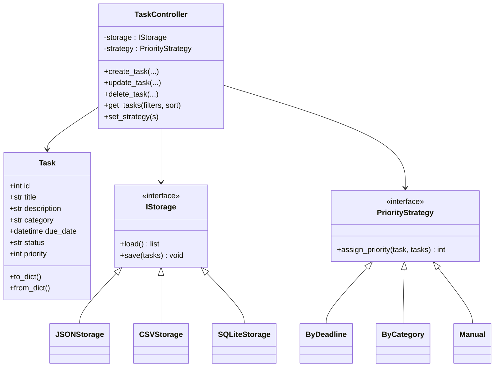
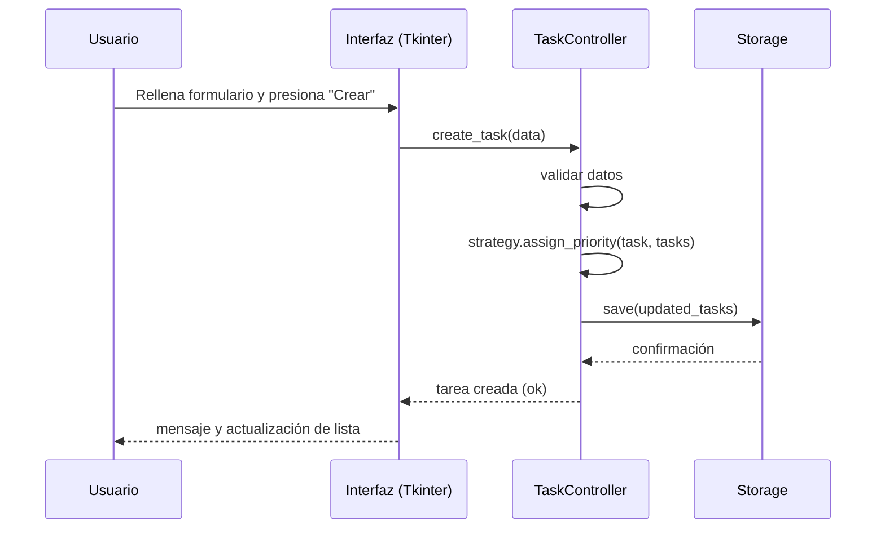

# Gestor de Tareas — Proyecto (README)

**Alumno(es):**  
**Curso:**  
**Fecha:**  

---

## 1. Resumen del proyecto
Aplicación de escritorio en Python para crear, visualizar, editar, eliminar y organizar tareas personales o académicas. Soporta campos: **título**, **descripción**, **categoría**, **fecha límite**, **estado** y **prioridad**. Incluye filtros, ordenamientos y un módulo de priorización inteligente implementado con el **Strategy Pattern**. Interfaz gráfica con **Tkinter**. Persistencia de datos compatible con **JSON**, **CSV** y **SQLite**.

---

## 2. Requisitos funcionales (resumidos)
- CRUD de tareas.
- Filtros por categoría, estado, prioridad y fecha límite.
- Ordenamiento por varios criterios.
- Módulo de priorización seleccionable (estrategias: por fecha, por tipo/categoría, manual).
- Persistencia en JSON, CSV o SQLite (configurable).
- Interfaz gráfica con Tkinter.
- Tests unitarios para la lógica de negocio.
- Documentación: casos de uso, diagramas UML, explicación de decisiones y README técnico.

---

## 3. Estructura propuesta del repositorio
```
task_manager/
├─ app.py                 # Inicializador de la aplicación (GUI)
├─ README.md              # Este archivo
├─ requirements.txt       # Dependencias (si aplica)
├─ src/
│  ├─ models/
│  │  └─ task.py
│  ├─ persistence/
│  │  ├─ storage_json.py
│  │  ├─ storage_csv.py
│  │  └─ storage_sqlite.py
│  ├─ prioritize/
│  │  ├─ strategy.py
│  │  ├─ by_deadline.py
│  │  ├─ by_category.py
│  │  └─ manual.py
│  ├─ controllers/
│  │  └─ task_controller.py
│  └─ gui/
│     └─ main_window.py
├─ tests/
│  └─ test_task_logic.py
└─ sample_data/
   └─ tasks_sample.json
```

---

## 4. Instalación (entorno local)
1. Clonar el repositorio:
   ```bash
   git clone <repo-url>
   cd task_manager
   ```
2. Crear entorno virtual (opcional pero recomendado):
   ```bash
   python -m venv venv
   source venv/bin/activate    # Linux / macOS
   venv\Scripts\activate       # Windows
   ```
3. Instalar dependencias (si las hay):
   ```bash
   pip install -r requirements.txt
   ```
> Nota: el proyecto puede funcionar con la librería estándar de Python (Tkinter y sqlite3). requirements.txt solo se usa si agregas librerías extra.

---

## 5. Ejecución
Para iniciar la interfaz gráfica (Tkinter):
```bash
python app.py
```
Para ejecutar pruebas:
```bash
pytest -q
```

---

## 6. Casos de uso (resumen)
1. **Crear tarea:** El usuario ingresa título, descripción, categoría, fecha límite y selecciona prioridad o deja que la estrategia asignadora la calcule.
2. **Editar tarea:** Modificar cualquier campo de una tarea existente.
3. **Eliminar tarea:** Borrar tarea.
4. **Visualizar lista:** Mostrar tabla/lista con tareas, con filtros y ordenamientos.
5. **Cambiar estrategia de prioridad:** Seleccionar entre estrategias disponibles (por fecha, por categoría, manual).
6. **Persistencia y carga:** Guardar y cargar tareas desde JSON/CSV/SQLite.

---

## 7. Diagrama de clases (Mermaid)


---

## 8. Diagrama de secuencia (Mermaid) — crear tarea


---

## 9. Decisiones de diseño y justificación
- **Separación de responsabilidades:** Models, persistence, GUI y lógica de negocio (controllers) están desacoplados para facilitar pruebas y mantenimiento.
- **Inyección de dependencias en controller:** TaskController recibe la implementación de storage y la estrategia de prioridad; esto permite cambiar persistencia o estrategia sin modificar la lógica.
- **Strategy Pattern:** Elegido para encapsular algoritmos de priorización y permitir selección en tiempo de ejecución sin condicionales extensos.
- **Persistencia flexible:** Implementaciones JSON/CSV/SQLite con interfaz común `IStorage` para permitir añadir otras fuentes en el futuro (p. ej. APIs).
- **Tkinter:** Suficiente para proyectos académicos, multiplataforma y disponible en la stdlib.

---

## 10. Estrategias de priorización (resumen)
- **ByDeadline:** Asigna mayor prioridad a tareas con fecha límite más cercana. (p. ej. prioridad = inverso de días restantes).
- **ByCategory:** Prioriza según categoría (configurable, p. ej. "Exámenes" > "Tareas" > "Lectura").
- **Manual:** El usuario asigna prioridad explícitamente.

---

## 11. Contratos/Esquema de persistencia (ejemplo JSON)
Ejemplo de un archivo `tasks_sample.json`:
```json
[
  {
    "id": 1,
    "title": "Preparar informe",
    "description": "Informe final del proyecto",
    "category": "Trabajo",
    "due_date": "2025-12-01T23:59:00",
    "status": "pendiente",
    "priority": 5
  },
  {
    "id": 2,
    "title": "Leer capítulo 4",
    "description": "Capítulo sobre patrones de diseño",
    "category": "Estudio",
    "due_date": "2025-11-25T18:00:00",
    "status": "en progreso",
    "priority": 3
  }
]
```

---

## 12. Pruebas unitarias (sugerencia)
- Ubicar tests en `tests/` usando `pytest`.
- Tests recomendados:
  - Crear/editar/borrar tarea en `TaskController`.
  - Asignación de prioridad según cada `PriorityStrategy`.
  - Carga/guardado en cada `IStorage`.
Ejecutar:
```bash
pytest -q
```

---

## 13. Ejemplos de uso rápido (línea de comandos del controlador)
```python
from src.controllers.task_controller import TaskController
from src.persistence.storage_json import JSONStorage
from src.prioritize.by_deadline import ByDeadline

storage = JSONStorage("data/tasks.json")
controller = TaskController(storage, ByDeadline())

controller.create_task(title="Tarea A", description="...", category="Estudio", due_date="2025-11-20T12:00:00")
tasks = controller.get_tasks(sort_by="priority")
```

---

## 14. Recomendaciones para entrega y evaluación
- Incluir un documento `DOCUMENTACION.pdf` con los diagramas exportados (opcional).
- Comentarios en código y docstrings en funciones/clases.
- Pruebas que cubran al menos un 70% de la lógica de negocio.
- Incluir ejemplos de datos en `sample_data/`.

---

## 15. Notas finales
Este README está creado para cubrir los requisitos académicos solicitados. Puedes pedirme que genere además:
- Código base (esqueleto del proyecto).
- Tests unitarios ejemplo.
- Archivos de persistencia con datos de muestra.
- Documentos PDF con diagramas generados.

---

**Licencia:** MIT (sugerida).
